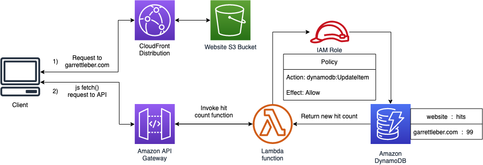

# lebergarrett.com - Backend

This repo holds the backend code for my personal website, created as part of the cloud resume challenge located at <https://cloudresumechallenge.dev>

`__main__.py` creates the S3 bucket the website is hosted in, maintains the route53 zone, and the SSL certificate (managed by ACM). The certificate and domain are attached to the S3 bucket through a CloudFront distribution. It also uses the packaged Python lambda function included in `lambda_function/`, spins it up in AWS and configures the proper role to give it the permissions it needs. It also creates the REST API that invokes the function, and spits that out as output to be used in the frontend (`counter.js`). Lastly, it creates the necessary DynamoDB table that stores the data for the visitor counter. Here's a flow diagram to illustrate

I use Github Actions to create a pipeline that runs unit tests for the lambda function, and `pulumi preview` for pull requests. When a pull request is merged to master it reruns the unit tests, packages and uploads the lambda function, and runs `pulumi up`.
